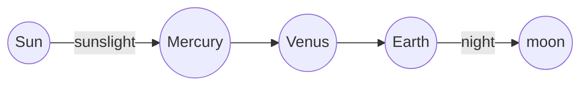

#  Flat Earth

Falsifications of the Heliocentric Solar System and Sphereical Earth

## No  measurable or visiable Earth curvature exists. We see too far if Earth is a ball.

 A sphereical earth requires there curvature (at the horizon) to obfuscate furhter objects.  This following table illustrates hidden inches and feet up to 1000 miles:

  
Miles | HiddenInches | HiddenFeet | HiddenInchesHeight | HiddenFeetHeight | HiddenMileHeight
---:|---:|---:|---|---:|---:
1 | (8) | -3 | -32 | (2.66) | (0.00)
5 | (200) | -13.68 | -164 | (13.68) | (0.00) 
10 | (798) | -59.85 | -718 | (59.85) | (0.01) 
20 | (3,192) | -254 | -3,049 | (254.11) | (0.05) 
30 | (7,182) | -583 | -6,991 | (582.59) | (0.11) 
50 | (19,950) | -1,640 | -19,683 | (1,640.22) | (0.31) 
100 | (79,800) | -6,616 | -79,392 | (6,616.00) | (1.25) 
500 | (1,995,000) | -166,167 | -1,993,999 | (166,166.55) | (31.47) 
600 | (2,872,800) | -239,308 | -2,871,696 | (239,308.02) | (45.32) 
1000 | (7,980,000) | -664,880 | -7,978,554 | (664,879.51) | (125.92)

#### The Formulas
$$ ( x = {-b \pm \sqrt{b^2-4ac} \over 2a} ) =   ax^2 + bx + c $$

$$ D= \sqrt{(2r_\ *H)+H} $$

$$ k_\ =r_\ - ( r_\  * ( \cos * (  E7 /(2 * r_\ )) ) )  $$

$$  k_\ =  {8 [inch] * (mile^2) } $$

$$ z = z^2 + c $$

---
## Venus or Mercury at night proves this solar system model is wrong:

If Venus is between the Earth and Sun, why is it visible at night for about 260 days per year? The night side of Earth looks away from the sun, therefore, Venus should not be visible.

---

## The atmosphere of Earth does not get sucked into the vacuum of space. 

The pressure of a gas is defined as the force the gas would exert upon a surface or container. 

## Rockets in space are not real, therefore space is not real. 

The emptiest parts of space can have pressures as low as 1015 mTorr, which is about a billion times less than the pressure of the Earth's atmosphere. 

Between the Earth and Moon, NASA says the pressure of space is 1011 mTorr.

It is impossible for the thrust of a rocket or the fan of a jet engine to create propolsion even in much more modest vacuums.

## The rotation of the Earth cannot be measured and has never been measured.
